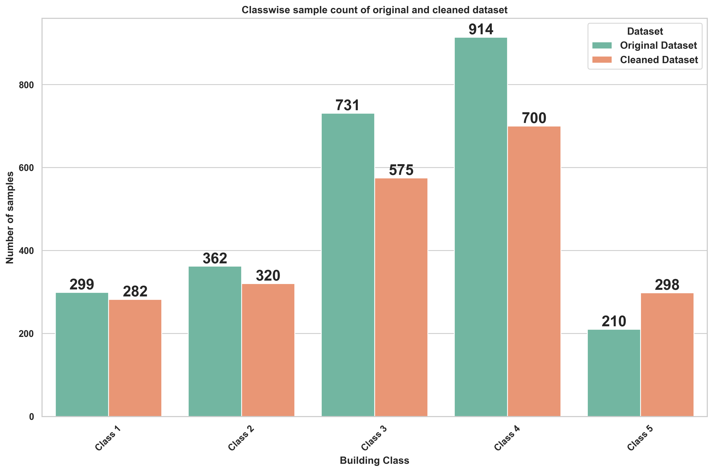

# Are you in a safe building: Street Vision based Automated Building Classification
Managing earthquake risks is essential due to the high potential for loss of life and economic damage. To mitigate building collapses, structural stability is a critical focus. Our project addresses the challenge of identifying potentially unsafe buildings in large urban areas by leveraging technology and data from street-view images. Traditional building-by-building inspections are impractical at scale, but advancements in machine learning offer a solution.This project aims to develop a supervised ML model to classify buildings by structural safety risk. We tackle challenges inherent in street-view imagery, such as noise and uneven distribution, through meticulous data cleaning and robust model development. Our objective is to enable accurate, scalable risk assessment for urban environments, contributing to safer cities.

## Dataset
The dataset for this project taken from Google Street View(GSV)-api which includes 2,516 grayscale images, each with a resolution of 300x400 pixels. These images represent five distinct building classes, differentiated by materials and structural characteristics as outlined in Table. Captured from various streets, the images offer diverse perspectives and building conditions, with each class exhibiting unique texture patterns related to its structural properties. Despite these distinctions, common features across classes increase the classification complexity. Annotations highlight key structural features to guide model training, but the dataset includes misclassified samples and class imbalances, necessitating rigorous data cleaning.

Descriptions of these defect classes along with the number of image samples available for each:

| Class  | Description                                                                    | Number of Images |
|--------------|--------------------------------------------------------------------------------|-----------------:|
| **Class 1 (SteelBuildings)**    |  Steel Buildings, large presence of glass, significant slenderness.        | 282            |
| **Class 2 (Concrete)** | Concrete, boxy aspect, smooth texture, persistent opening.                                            | 320             |
| **Class 3 (Masonry)** |  Masonry, bricks exposed, no soft story, decorative patterns.                                               | 575             |
| **Class 4 (Woodenframed)**  | Wooden framed, wooden bow windows, slanted roof.                                           | 700          |
| **Class 5 (panel buildings)** | Steel with panel, industrial/retail, max 2 floors, non-slanted roof.                                        | 298            |

## Sample Images

<table border="0" style="text-align: center;">
  <tr>
    <td style="text-align: center;"> <b>(a) Class 1</b></td>
    <td style="text-align: center;"> <b>(b) Class 2</b></td>
    <td style="text-align: center;"> <b>(c) Class 3</b></td>
  
  </tr>
  <tr>
    <td style="text-align: center;"> <b>(e) Class 4</b></td>
    <td style="text-align: center;"> <b>(f) Class 5</b></td>
  </tr>
</table>

<i>Figure : Classwise sample counts</i>

## Benchmarking Results
| Model   | Precision | Recall | F-1 Score | Test Accuracy | Remark |
|---------|-----------|--------|-----------|---------------|--------|
| **Classical models**    | - | - | - | 0.297(SVM) | Sensitivity to high-dimensional data, difficult to find a clear hyperplane for separation |
| **Resnet50** |  0.51 | 0.51 | 0.50 | 0.46 | Lacks data to capture global patterns relying heavily on local feature extraction |
| **EfficentNet** | 0.52 | 0.51 | 0.51 | 0.481 | Sensitive to insufficient data, scaling approach may not capture intricate global features|
| **Vit**  |  0.57  | 0.58 | 0.57 | 0.539 | Not able to fully understand global relationships |
| **DeiT** | 0.63 | 0.64 | 0.63 | 0.531 | Not effectively capture subtle differences in features, leading to suboptimal performance |
| **SWin Base** | 0.67 | 0.66 | 0.66 | 0.606 | Efficiently captured both local and global feature still require more data /fine-tuning for optimal results |

